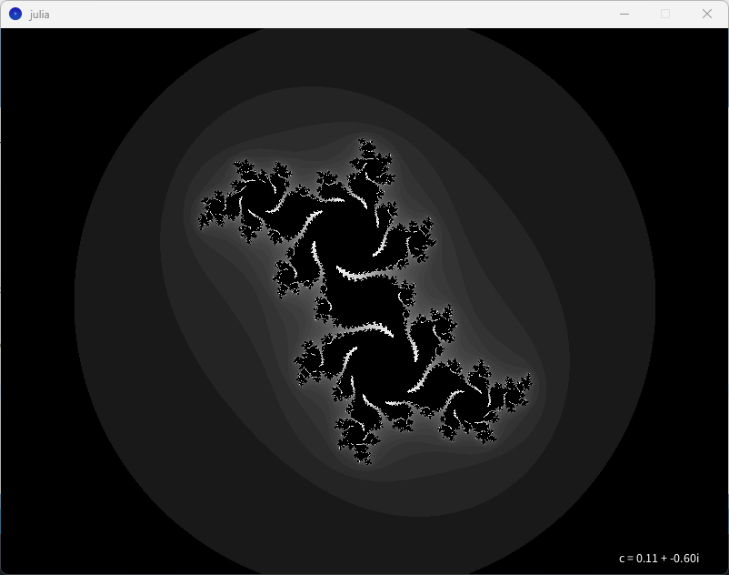

# Fractal Art with L-Systems and Julia Sets

This project explores the fascinating intersection of art, mathematics, and code. Leveraging the power of L-Systems and Julia Sets, it creates intricate fractal images that showcase the beauty of recursive patterns and complex mathematical structures.

## Overview

The project includes two main components:

### Julia Sets
- **Examples:** `exampleJulia1.png`, `exampleJulia2.png`, `exampleJulia3.png`
- The Julia Sets are generated by varying the complex constant `c` in the recurrence relation `zₙ = zₙ₋₁² + c`. Each image represents a unique Julia Set obtained by exploring different values of `c`.
- Interactivity: Zoom in/out and pan around the canvas to discover the mesmerizing details of each Julia Set.
- **How to Run:** Open the `julia.pde` file in Processing and run the sketch.

### Simple L-Systems
- **Examples:** `dragonCurve.png`, `kochCurve.png`, `sierpinskiTriangle.png`
- Simple L-Systems, like the Dragon Curve, Koch Curve, and Sierpinski Triangle, are visualized using the Processing graphical library.
- Define L-Systems with up to two variables and two grammar rules, incorporating rotations with the '+' and '-' symbols.
- **How to Run:** Open the `l_systems_fractals.pde` file in Processing and run the sketch.

## Getting Started

1. Install [Processing](https://processing.org/download/), if not already installed.
2. Open the respective `.pde` file (`julia.pde` or `l_systems_fractals.pde`) in Processing.
3. Click the "Run" button to see the magic unfold!

## About the Project

This project served as a creative exploration into the world of fractals, blending artistry, mathematical concepts, and programming. Notably, it introduced me to Java and the Processing IDE, providing an opportunity to learn and apply L-Systems and the definition of Julia Sets. Translating these abstract concepts into code required both artistic intuition and programming skill.

Feel free to explore, modify, and create your own fractal masterpieces!

*Julia sets for different c values can result in beautiful, complex patterns*
